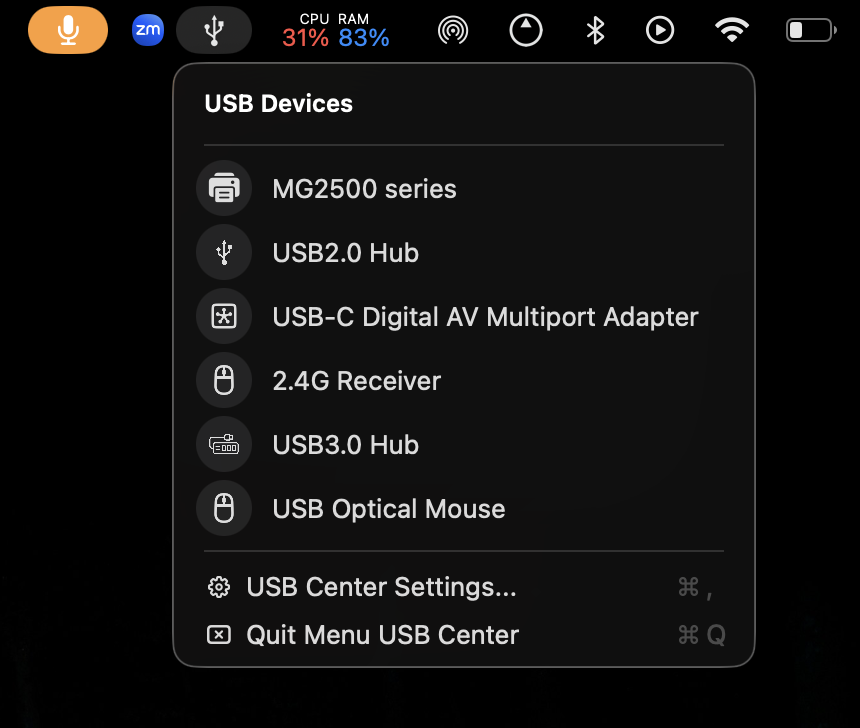
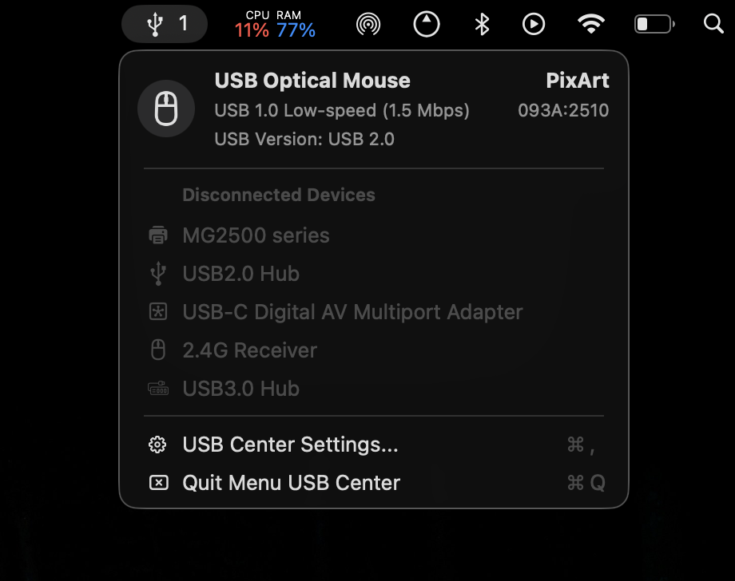
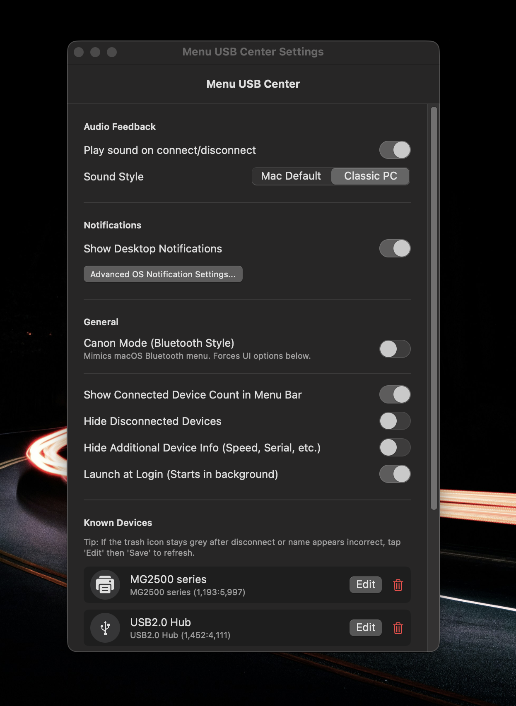
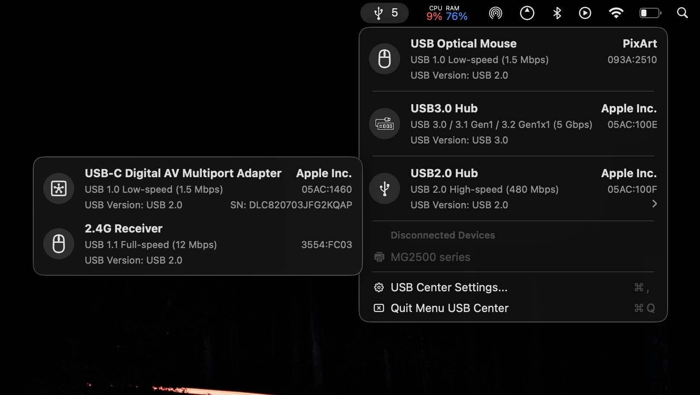
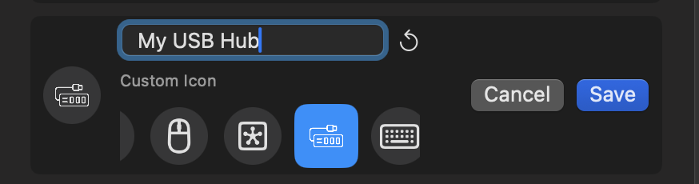
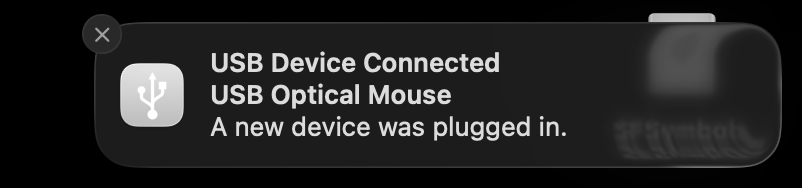
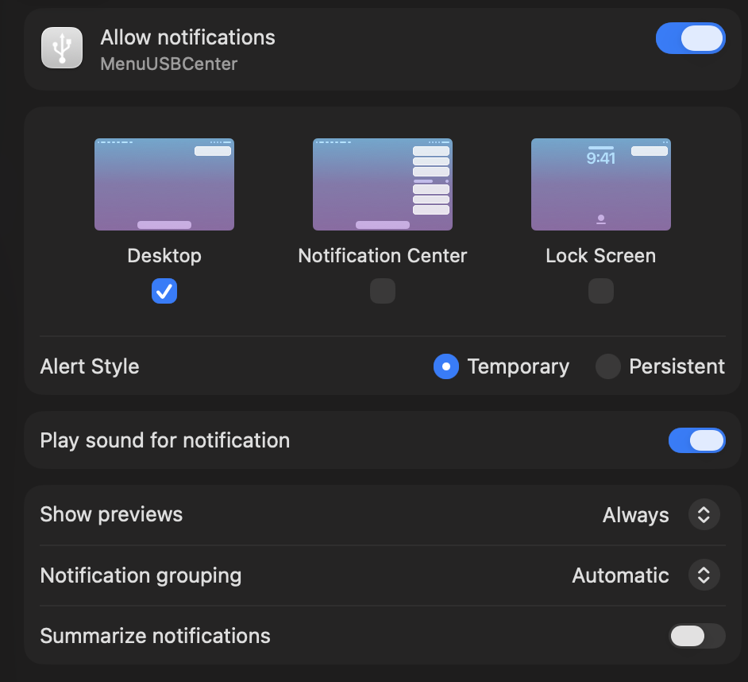

# Menu USB Center 

A clean, native macOS menu bar utility to monitor and manage your USB devices.

## Features
- **Real-time Monitoring**: Get notified instantly when USB devices are connected or disconnected.
- **Canon Mode**: A high-fidelity mode that perfectly mimics the look and feel of the native macOS Bluetooth menu.
- **Hub Hierarchy**: View nested USB hubs and their connected devices in a clear tree structure.
- **Customization**: Rename your devices with custom aliases and choose between modern icons.
- **Audio Feedback**: Classic connection and disconnection sounds.
- **Lightweight**: Built with Swift and SwiftUI for maximum performance and native integration.

## Screenshots

| Canon Mode | Standard Mode |
|:---:|:---:|
|  |  |

| Settings | Nested USB Hubs |
|:---:|:---:|
|  |  |

| Edit Device | Optional Notifications |
|:---:|:---:|
|  |  |

## Recommended System Settings
For the best experience, we recommend adjusting macOS's built-in notification settings for the app so that alerts properly stay on your screen. Go to **System Settings > Notifications > MenuUSBCenter** and match the configuration below:

## Installation
1. Go to the [Releases](https://github.com/rohilshah2006/menu-usb-center/releases) page.
2. Download the `MenuUSBCenter.zip` file.
3. Unzip the file and move `MenuUSBCenter.app` to your `/Applications` folder.
4. **Important (Gatekeeper Warning)**: Since this app is not signed with a paid Apple Developer certificate, macOS will show a "cannot be opened because it is from an unidentified developer" or "malware" warning. This is normal for indie open-source apps. 
   
   **To fix this:**
   - **DO NOT** just double-click it.
   - **Right-Click** (or Control-Click) the app in your Applications folder and select **Open**.
   - **If Right-Click -> Open still doesn't work:**
     - Open **System Settings** -> **Privacy & Security**.
     - Scroll down and find the message stating "MenuUSBCenter was blocked..."
     - Click **Open Anyway** and confirm with your password/Touch ID.
   - You only have to do this once!

## Canon Mode
Enable **Canon Mode** in the settings to transform the UI into a 1:1 replica of the macOS native system menus, featuring:
- Identical typography and spacing.
- Native status indicators (blue for connected, grey for disconnected).
- Streamlined device list.

## Development
To build the app from source:
1. Clone the repository.
2. Run `./build.sh`.
3. The app will be generated as `MenuUSBCenter.app`.

## License
This project is licensed under the MIT License - see the [LICENSE](LICENSE) file for details.

---
Created by Rohil
